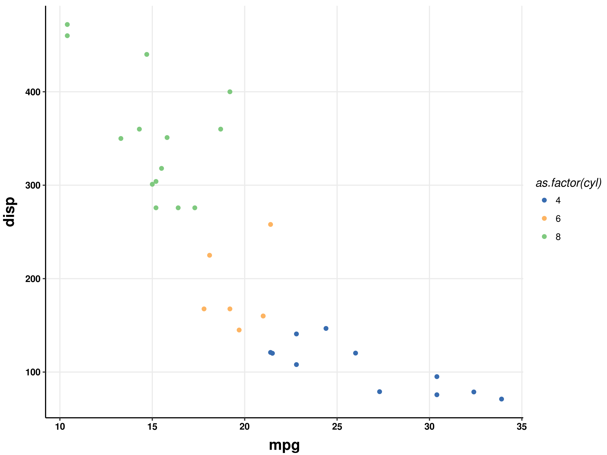

# 这个仓库作为onmath可视化的基本配色方案和主题设置

配色方案基于[**karthik's wesanderson**](https://github.com/karthik/wesanderson)和[**RColorBrewer**](https://github.com/cran/RColorBrewer)[**ggthemes**](https:/github.com/jrnold/ggthemes)
在R环境下安装这些包：
```
install.packages("wesanderson")
install.packages("ggthemes")
```
或者安装develpment version:
```
devtools::install_github("karthik/wesanderson")
```
## heatmap_color_schemes
- heatmap_color_schemes1


- heatmap_color_schemes2


- heatmap_color_schemes3


## div_color_schemes
- div <= 3:


- div = 5:


- div >= 10:


## theme
```
basic_theme <- theme_bw()
```
## forexample
- boxplot for div5 in RColorBrewer


- boxplot for div5 in wesanderson


- a demo of onmath_theme


